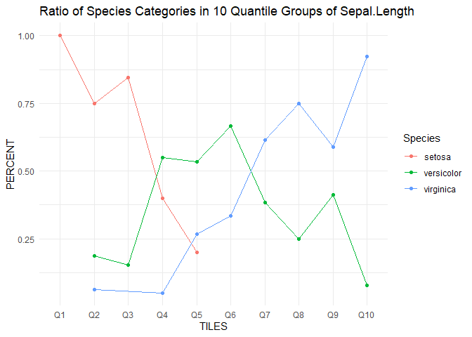
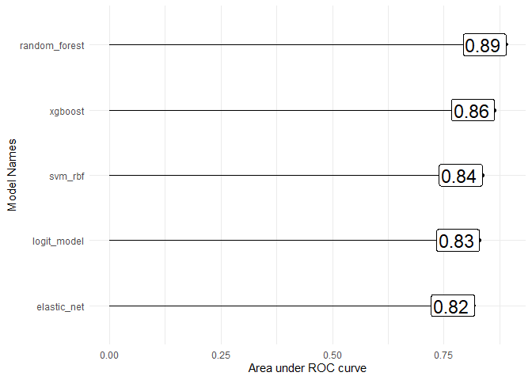

<!-- README.md is generated from README.Rmd. Please edit that file -->

# mixBag

<!-- badges: start -->
<!-- badges: end -->

*mixBag* is a package that encapsulates several repeated tasks that a
data scientist performs regularly in data analysis and modeling into
some simple wrapper functions. The main goals of *mixBag* are to make
repeat activities faster and more efficient.

## Installation

This package is only available in GitHub. You can install the latest
development version from [GitHub](https://github.com/) with:

``` r
# install.packages("devtools")
devtools::install_github("Curious-Joe/mixBag")
```

## Usage

*mixBag* has several useful functions aimed at simplifying tasks in
different areas of work that a data analysis. Couple of examples are
shown below:

### qtile\_plot()

Plotting percentage of different target feature labels in different
quantile groups of a predictor feature.

``` r
library(mixBag)

# plot percentage of different target labels in different quartiles of a predictor
qtile_plot(iris,x_feat = Sepal.Length, y_feat = Species, quantile = 10)
#> Quantile boundaries:
#>   0%  10%  20%  30%  40%  50%  60%  70%  80%  90% 100% 
#> 4.30 4.80 5.00 5.27 5.60 5.80 6.10 6.30 6.52 6.90 7.90 
#> 
#> Quantile wise total counts:
#> TILES
#>  Q1  Q2  Q3  Q4  Q5  Q6  Q7  Q8  Q9 Q10 
#>  16  16  13  20  15  15  13  12  17  13
```



### compare\_classifiers()

Fit 5 classifiers on a training data and compare results based on ROC on
provided test data. *mixBag* model related functions rely heavily upon
the suite of packages that come along with *tidymodels* package.

``` r
library(tidymodels)
#> -- Attaching packages ----------------------------------------- tidymodels 0.1.1 --
#> v broom     0.7.0      v recipes   0.1.13
#> v dials     0.0.8      v rsample   0.0.7 
#> v dplyr     1.0.2      v tibble    3.0.3 
#> v ggplot2   3.3.2      v tidyr     1.1.0 
#> v infer     0.5.3      v tune      0.1.1 
#> v modeldata 0.0.2      v workflows 0.2.0 
#> v parsnip   0.1.3      v yardstick 0.0.7 
#> v purrr     0.3.4
#> -- Conflicts -------------------------------------------- tidymodels_conflicts() --
#> x purrr::discard() masks scales::discard()
#> x dplyr::filter()  masks stats::filter()
#> x dplyr::lag()     masks stats::lag()
#> x recipes::step()  masks stats::step()
library(rsample)
split <- initial_split(wine, strata = quality_bin)
train <- training(split)
test <- testing(split)
recipe <- recipe(quality_bin ~ ., data = train) %>%
  update_role(ID, new_role = 'identification') %>%
  step_string2factor(all_nominal()) %>%
  step_knnimpute(all_predictors()) %>%
  step_normalize(all_numeric())

compare_classifiers(recipe = recipe, test_df = test, target_lab = 1)
#> fitting logit model...
#> fitting elastic net...
#> fitting random forest...
#> fitting xtreeme gradient boosting...
#> fitting support vector machine...
#> calculating predictions
#> plotting performance curves
```



## Getting Help

For any question or bug fix feel free to send email at
<a.h.fahad90@gmail.com>.
